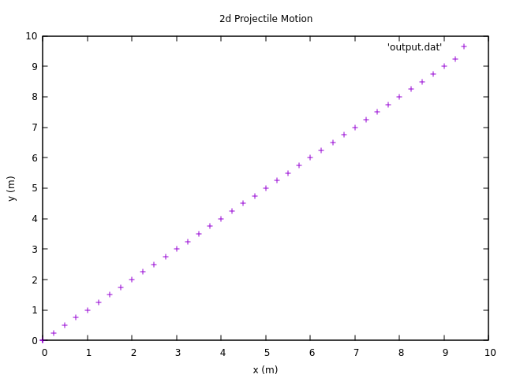
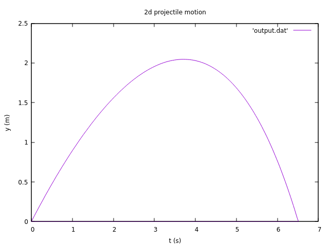
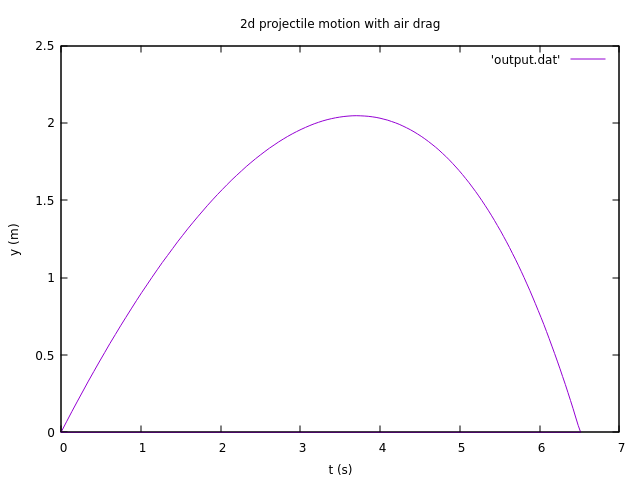
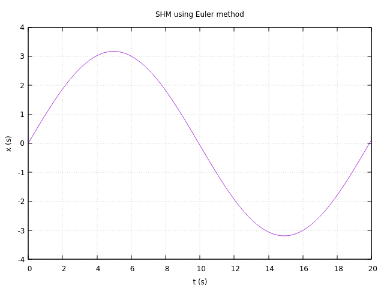
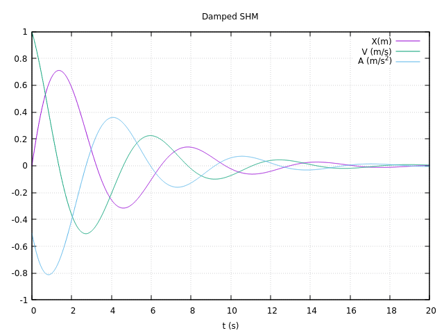
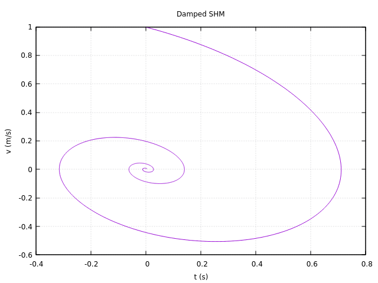
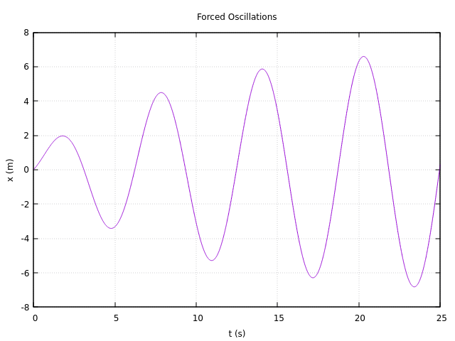

# Cpp-Computational-Physics
Collection of C++ computational physics programs

# How to run program

## On Linux

You need to have `gnuplot` installed on your system as this is what is used for plotting

1) Compile

    `g++ <program name>.cpp -o <output filename> -l boost_filesystems -l boost_iostreams`

2) Compile and Run

    `g++ <program name>.cpp -o <output filename> -l boost_filesystems -l boost_iostreams && ./<output filename>`

# What are the utils.cpp and gnuplot_iostream.h files?

The file `utils.cpp` is the utility program I wrote that contains some custom functions and data-structures that might be of use for my specific use case
and `gnuplot_iostream.h` is the header-only library from [GitHub](https://github.com/dstahlke/gnuplot-iostream) that is used for accessing gnuplot
directly from within the C++ program

# Screenshots

